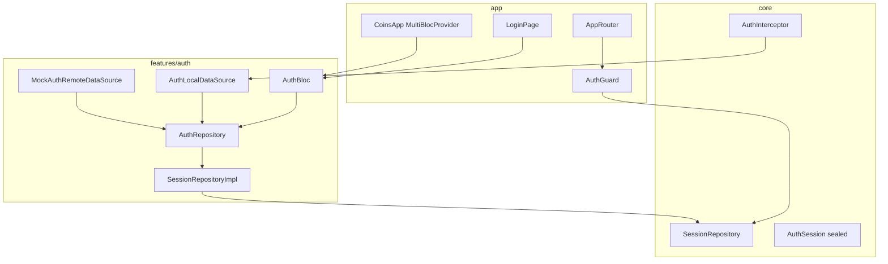

# JWT Auth с мок-репозиторием

## Цели и ограничения

- **Full gate**: без сессии доступен только экран логина; после входа — текущее приложение ([`MainLayoutRoute`](lib/app/router/app_router.dart)).
- **User внутри auth**: `AuthUser { id, email }` в сессии, без отдельной `features/user/`.
- **Без бэкенда**: mock data source имитирует login/refresh с задержкой и фиксированными credentials.
- **Без кросс-импортов**: другие фичи (если понадобятся позже) зависят только от [`core/session`](lib/core/session/), не от `features/auth/`.

## Архитектура



## Зависимости между слоями

| Слой                                | Зависит от                                               |
| ----------------------------------- | -------------------------------------------------------- |
| `core/session/*`                    | только Dart/core types                                   |
| `features/auth/domain`              | `core` (Either, Failure, UseCase)                        |
| `features/auth/data`                | domain + `core/session` (implements `SessionRepository`) |
| `features/auth/presentation`        | domain use cases                                         |
| `app/pages`, `app/router`           | `features/auth` + `core/session` (composition root)      |
| `features/posts`, `features/crypto` | **не импортируют** `features/auth`                       |

---

## 1. `core/session/` — контракт сессии

Новые файлы:

- [`lib/core/session/auth_session.dart`](lib/core/session/auth_session.dart) — sealed class:
  - `AuthSessionUnknown` (начальная проверка)
  - `AuthSessionAuthenticated(AuthUser user, AuthTokens tokens)`
  - `AuthSessionUnauthenticated`
- [`lib/core/session/auth_user.dart`](lib/core/session/auth_user.dart) — `{ id, email }` (Equatable)
- [`lib/core/session/auth_tokens.dart`](lib/core/session/auth_tokens.dart) — `{ accessToken, refreshToken, accessExpiresAt }`
- [`lib/core/session/session_repository.dart`](lib/core/session/session_repository.dart):

```dart
abstract interface class SessionRepository {
  Stream<AuthSession> get sessionChanges;
  AuthSession get currentSession;
}
```

Это единственная точка, к которой другие фичи смогут подключаться без импорта auth.

---

## 2. `features/auth/domain/`

**Repository** — [`auth_repository.dart`](lib/features/auth/domain/repositories/auth_repository.dart):

- `login(email, password)` → `Either<Failure, AuthSessionAuthenticated>`
- `logout()` → `Either<Failure, void>`
- `restoreSession()` → `Either<Failure, AuthSession>` (читает local, проверяет expiry, при необходимости refresh)
- `refreshToken()` → `Either<Failure, AuthTokens>`

**Use cases** (thin delegates, как в posts):

- `Login`, `Logout`, `RestoreSession`, `RefreshToken`

---

## 3. `features/auth/data/` — mock + local storage

### Local: token storage

[`auth_local_data_source.dart`](lib/features/auth/data/datasources/auth_local_data_source.dart) — паттерн как [`ThemeStorage`](lib/core/theme/theme_storage.dart) на `SharedPreferences`:

- ключи: `access_token`, `refresh_token`, `access_expires_at`, `user_id`, `user_email`
- `saveSession(...)`, `readSession()`, `clearSession()`

> Для учебного проекта — `SharedPreferences`. В комментарии отметить, что для prod лучше `flutter_secure_storage`.

### Remote: mock JWT

[`auth_remote_data_source.dart`](lib/features/auth/data/datasources/auth_remote_data_source.dart) — abstract interface.

[`mock_auth_remote_data_source.dart`](lib/features/auth/data/datasources/mock_auth_remote_data_source.dart):

- фиксированные credentials: `test@example.com` / `password` (константы в mock-классе, опционально вынести в [`.env.example`](.env.example) позже)
- `login`: `Future.delayed(500ms)`, при неверных данных — `Left(InvalidCredentialsFailure)`
- **JWT-like tokens** без внешнего пакета: helper `MockJwtGenerator` генерирует строку `header.payload.signature` (base64 JSON с `sub`, `email`, `exp`)
- access TTL: **5 мин**, refresh TTL: **7 дней**
- `refresh(refreshToken)`: валидирует refresh, возвращает новую пару; просроченный/невалидный refresh → `Left(UnauthorizedFailure)`

### Repository impl

[`auth_repository_impl.dart`](lib/features/auth/data/repositories/auth_repository_impl.dart):

- orchestration: remote mock + local storage
- `restoreSession`: если access expired но refresh valid → auto refresh; иначе clear + unauthenticated
- `mapExceptionToFailure` / `mapDioException` для единообразия с posts/crypto

[`session_repository_impl.dart`](lib/features/auth/data/repositories/session_repository_impl.dart):

- implements `SessionRepository`
- держит `BehaviorSubject`/`StreamController` или простой `Stream` + in-memory `currentSession`
- обновляется из `AuthRepositoryImpl` при login/logout/restore/refresh

---

## 4. `features/auth/presentation/` — AuthBloc + Login UI

### AuthBloc

[`auth_bloc.dart`](lib/features/auth/presentation/blocs/auth_bloc.dart):

| Event                                 | Действие         |
| ------------------------------------- | ---------------- |
| `AuthAppStarted`                      | `RestoreSession` |
| `AuthLoginSubmitted(email, password)` | `Login`          |
| `AuthLogoutRequested`                 | `Logout`         |

| State                            | Когда                      |
| -------------------------------- | -------------------------- |
| `AuthStatus.unknown`             | старт, restore in progress |
| `AuthStatus.authenticated(user)` | успешный login/restore     |
| `AuthStatus.unauthenticated`     | нет сессии / logout        |
| `AuthStatus.failure(Failure)`    | ошибка login               |

Bloc **не** импортирует auto_route — навигацию делает `app/` через `BlocListener`.

### LoginView

[`login_view.dart`](lib/features/auth/presentation/views/login_view.dart):

- email/password fields + кнопка
- `BlocConsumer<AuthBloc, AuthState>` для loading/error
- без `getIt` — callbacks/events через bloc

[`lib/app/pages/login_page.dart`](lib/app/pages/login_page.dart) — `@RoutePage`, `BlocProvider.value` или create из getIt.

---

## 5. Dio AuthInterceptor (подготовка к реальному API)

[`lib/core/network/interceptors/auth_interceptor.dart`](lib/core/network/interceptors/auth_interceptor.dart):

- onRequest: читает access token из `AuthLocalDataSource` (inject), добавляет `Authorization: Bearer ...`
- onError 401: вызывает `AuthRepository.refreshToken()`, повторяет запрос один раз; при fail — clear session

Подключить в [`DioFactory.create`](lib/core/network/dio_factory.dart) / [`core_scope.dart`](lib/app/di/core_scope.dart) **после** регистрации auth-модуля (auth DI регистрируется до или ApiClient пересоздаётся lazy с interceptor).

> На первом этапе существующие API (jsonplaceholder, cryptocompare) работают без auth — interceptor просто не добавляет header, если токена нет.

---

## 6. DI — `features/auth/di/auth_di.dart`

По образцу [`posts_di.dart`](lib/features/posts/di/posts_di.dart):

```dart
void registerAuthModule() {
  getIt.registerLazySingleton<AuthLocalDataSource>(...);
  getIt.registerLazySingleton<AuthRemoteDataSource>(() => MockAuthRemoteDataSource());
  getIt.registerLazySingleton<AuthRepository>(() => AuthRepositoryImpl(...));
  getIt.registerLazySingleton<SessionRepository>(() => SessionRepositoryImpl(...));
  // use cases
  getIt.registerLazySingleton<AuthBloc>(() => AuthBloc(...)..add(AuthAppStarted()));
}
```

Обновить [`lib/app/di/di.dart`](lib/app/di/di.dart): `registerAuthModule()` **до** crypto/posts (interceptor может понадобиться раньше).

---

## 7. Навигация и full gate

### Routes

Обновить [`app_router.dart`](lib/app/router/app_router.dart):

```
/login          → LoginRoute (initial при cold start без сессии)
/               → MainLayoutRoute, guards: [AuthGuard]
```

### Guards

[`lib/app/router/guards/auth_guard.dart`](lib/app/router/guards/auth_guard.dart):

- если `SessionRepository.currentSession is Authenticated` → `resolver.next()`
- иначе → `resolver.redirect(LoginRoute())`

[`lib/app/router/guards/guest_guard.dart`](lib/app/router/guards/guest_guard.dart):

- если уже authenticated → redirect на `MainLayoutRoute`
- иначе → показать LoginPage

### App root

[`lib/app/app.dart`](lib/app/app.dart):

```dart
MultiBlocProvider(
  providers: [BlocProvider.value(value: getIt<AuthBloc>())],
  child: BlocListener<AuthBloc, AuthState>(
    listener: (context, state) {
      // authenticated → replace MainLayoutRoute
      // unauthenticated → replace LoginRoute
    },
    child: MaterialApp.router(...),
  ),
)
```

`AuthAppStarted` dispatch в `auth_di` при создании bloc (или в `bootstrap` после `setupDI`).

`flutter pub run build_runner build` для перегенерации `app_router.gr.dart`.

---

## 8. Settings — logout и отображение email

Расширить [`settings_view.dart`](lib/features/settings/presentation/views/settings_view.dart):

- новые props: `AuthUser? user`, `VoidCallback onLogout`, `bool isAuthenticated`
- Card с email (если authenticated) + кнопка «Выйти»

[`settings_page.dart`](lib/app/pages/settings_page.dart) — единственное место с `getIt`:

- `BlocBuilder<AuthBloc, AuthState>` оборачивает `SettingsView`
- onLogout → `context.read<AuthBloc>().add(AuthLogoutRequested())`

---

## 9. Failures и l10n

Новые failures в [`failures.dart`](lib/core/error/failures.dart):

- `InvalidCredentialsFailure`
- `UnauthorizedFailure` (expired refresh)
- `SessionExpiredFailure`

Строки в [`app_en.arb`](lib/core/l10n/app_en.arb) / [`app_ru.arb`](lib/core/l10n/app_ru.arb):

- login title, email hint, password hint, submit, invalid credentials, logout

---

## 10. Демонстрация cross-feature доступа (опционально, минимально)

Чтобы показать паттерн без кросс-импортов — в [`posts_page.dart`](lib/app/pages/posts_page.dart) добавить в AppBar subtitle с email через `context.select<AuthBloc, ...>` **на уровне page**, не в `PostsListView`. View остаётся чистым.

---

## Порядок реализации

1. `core/session/*` + failures
2. `features/auth/domain`
3. `features/auth/data` (mock JWT + local storage + repository impl)
4. `features/auth/presentation` (AuthBloc + LoginView)
5. `features/auth/di/auth_di.dart` + wiring в `di.dart`
6. Router guards + LoginPage + BlocListener в `app.dart`
7. AuthInterceptor + подключение к ApiClient
8. Settings logout UI + l10n
9. `build_runner` + ручная проверка сценариев

## Сценарии ручной проверки

1. Cold start без токенов → LoginPage
2. Login `test@example.com` / `password` → MainLayout
3. Kill app → restore session → сразу MainLayout
4. Logout в Settings → LoginPage
5. (Опционально) подождать 5 мин / подменить expiry в prefs → restore триггерит refresh
6. Невалидный refresh в prefs → clear → LoginPage

## Что сознательно не делаем

- Отдельная `features/user/`
- Unit-тесты (по вашему решению)
- Реальный backend / OAuth
- `flutter_secure_storage` (только комментарий как next step)

## Замена mock на real API (future)

1. Добавить `AuthRemoteDataSourceImpl` с реальными endpoints в [`Env`](lib/core/config/env.dart)
2. В `auth_di.dart` swap: `MockAuthRemoteDataSource` → `AuthRemoteDataSourceImpl`
3. AuthInterceptor уже готов для 401/refresh
